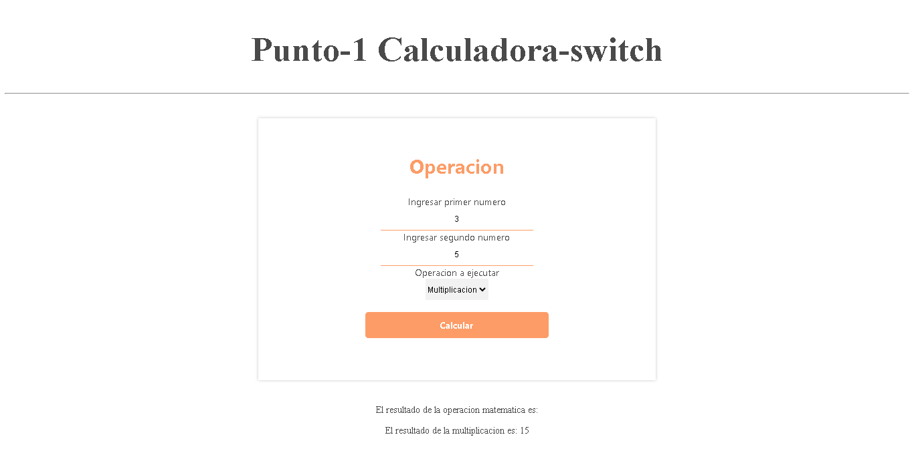
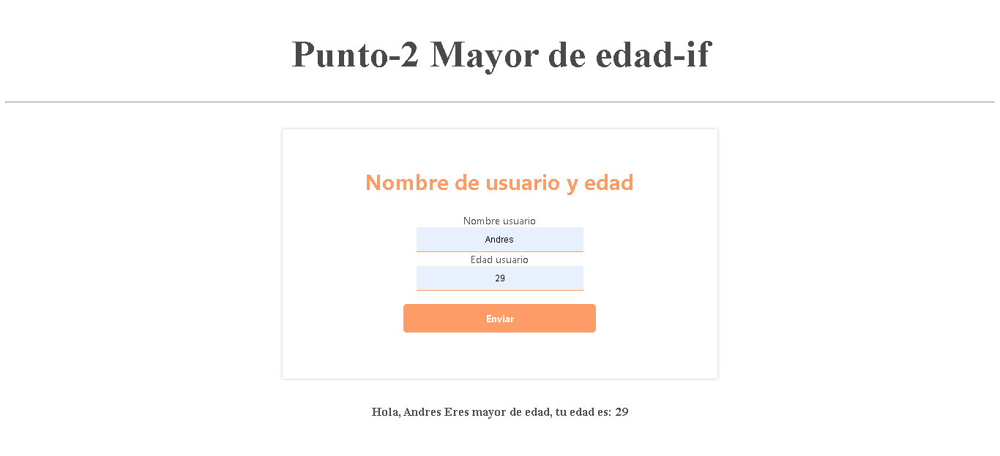
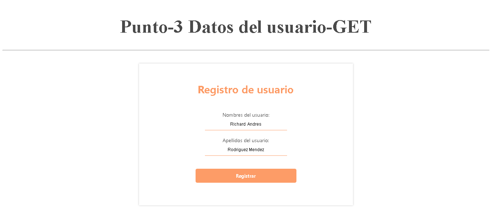
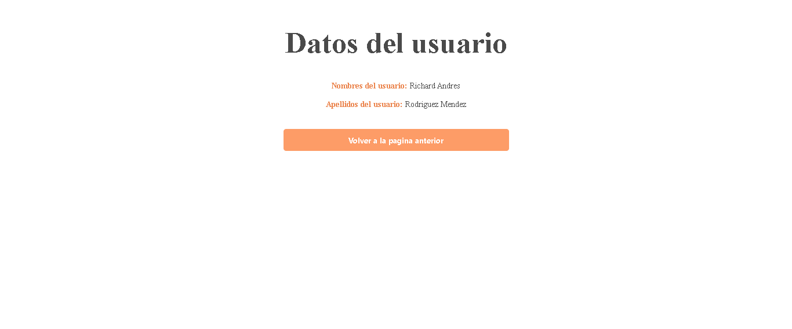
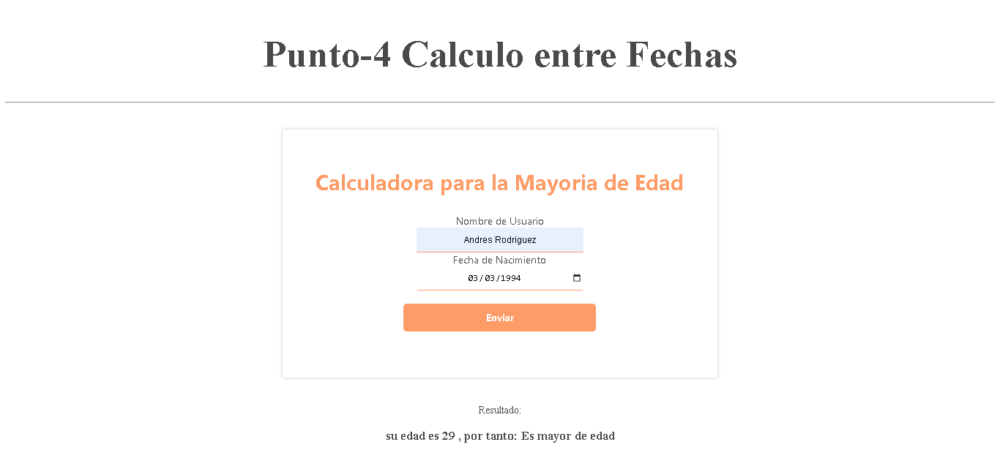
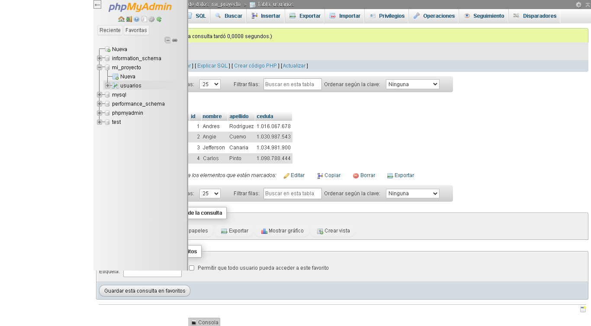
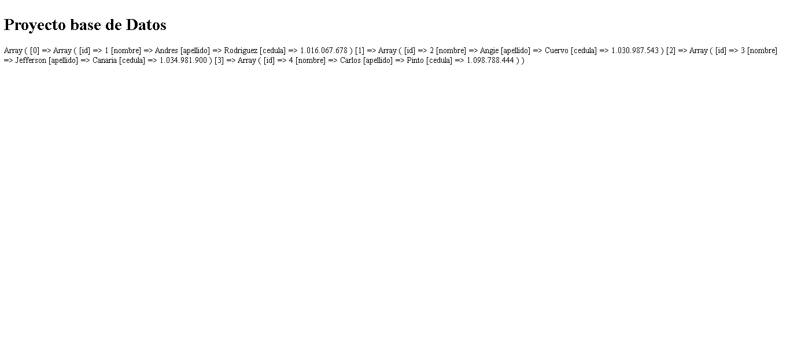
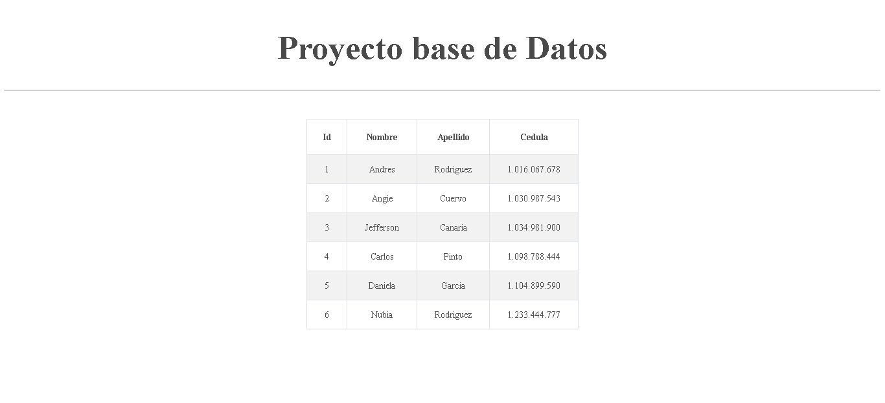

<h1>Taller 10 Andres Rodriguez</h1>

<h2>Informacion</h2>

Curso: Full Stack Basico -
Grupo 1

Profesor: Cristian Patiño 

<h2>Punto 1: </h2>
<h3>1 - Calculadora-switch</h3>

<h2>Punto 2: </h2>
<h3>2 - Mayor edad-if</h3>

<h2>Punto 3: </h2>
<h3>3- Datos usuario-get</h3>

<h2>Punto 4: </h2>
<h3>4- Calculo entre fechas</h3>

<h2>Punto 5-6-7: </h2>
<h3>5 - Base de datos</h3>

<h3>6 - Conexión</h3>

<h3>7 - Muestra de datos en pantalla</h3>

